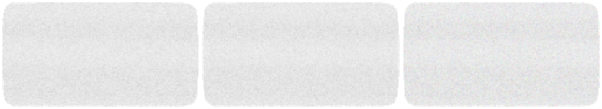

<div align="center">
  
  <h1>Adi's Portfolio</h1>
  <p>A personal portfolio built to look and feel like the Wii Menu.</p>
  <a href="https://adifolio.vercel.app"><strong>adifolio.vercel.app →</strong></a>
  <br /><br />
  
</div>

---

## What it is

The Wii Menu UI is recreated in React. Each channel slot holds something: a case study, a link to GitHub or LinkedIn, a resume, or the Mii channel which opens an about-me card. Clicking a channel takes you to a preview screen with channel art, audio, and a Start button. Right-clicking opens the Wii home menu overlay.

Everything from the cursor to the startup sound to the warning screen is faithful to the original.

---

## Channels

| Channel | What it does |
|---|---|
| Disc Channel | Decorative — plays disc audio and animation |
| Mii Channel | Opens an about-me paper with bio and personal info |
| Research Agent | Case study — opens Figma deck |
| Credit Survey | Case study — opens Figma deck |
| Credit Website | Opens Medium article |
| Tufte's Razor | Case study in progress — opens live site |
| Github | Links to GitHub profile |
| LinkedIn | Links to LinkedIn profile |
| Resume | Opens resume PDF |

---

## Stack

- **React 19** + **Vite 7**
- **Howler.js** for all audio (SFX, channel previews, background music)
- **CSS** only — no UI library
- Custom Wii fonts (FOT-Rodin, Continuum)
- Deployed on **Vercel** with aggressive caching for assets, audio, and fonts

---

## Project structure

```
wii-portfolio-react/
├── public/
│   ├── assets/          # UI images, cursor, buttons
│   ├── audio/           # SFX and background music
│   ├── channelart/      # Per-channel HTML + art (rendered in iframes)
│   │   ├── disc/
│   │   ├── mii/
│   │   ├── tuftes-razor/
│   │   └── ...
│   ├── channels/        # Per-channel preview video + audio
│   └── fonts/           # FOT-Rodin, Continuum, Digital-7
└── src/
    ├── components/
    │   ├── SplashScreen.jsx     # Warning screen + asset preloader
    │   ├── MainMenu.jsx         # Channel grid with pagination
    │   ├── Channel.jsx          # Individual channel tile
    │   ├── ChannelSelection.jsx # Full-screen channel preview
    │   ├── MiiPaper.jsx         # About-me overlay
    │   ├── BottomBar.jsx        # Bottom nav bar
    │   ├── HomeMenu.jsx         # Right-click home overlay
    │   ├── MessageBoard.jsx     # Message board screen
    │   ├── Settings.jsx         # Settings panel
    │   └── ReturnDialog.jsx     # "Return to Wii Menu?" dialog
    ├── context/
    │   ├── AudioContext.jsx     # Howler wrappers, SFX, bg music
    │   ├── ChannelsContext.jsx  # Channel list + localStorage persistence
    │   └── ConfigContext.jsx    # Volume settings + localStorage
    └── hooks/
        └── useDateTime.js       # Wii-style date/time hook
```

---

## Running locally

```bash
cd wii-portfolio-react
npm install
npm run dev
```

Then open `http://localhost:5173`.

```bash
npm run build    # production build
npm run lint     # ESLint check
npm run preview  # preview the production build locally
```

---

## How channels work

Each channel is an object in `ChannelsContext.jsx`:

```js
{
  id: 'tuftes-razor',
  title: "Tufte's Razor",
  assets: 'assets/channels/',   // preview video + audio path
  channelart: 'channelart/',    // iframe art path
  target: 'https://...',        // URL opened on Start
  action: 'open-paper'          // optional: 'open-paper' for Mii overlay
}
```

Channel art (`/channelart/{id}/channel.html`) is rendered inside an iframe in the grid tile. The preview screen loads `/assets/channels/{id}/video.{format}` and `/assets/channels/{id}/audio.{format}`.

Channel state is persisted to `localStorage` under the key `adifolio-channels-v17`. Bumping the version resets to defaults on next load.

---

## CI

GitHub Actions runs ESLint on every push and PR to `main` via `.github/workflows/lint.yml`. Vercel deploys automatically on merge to `main`.
